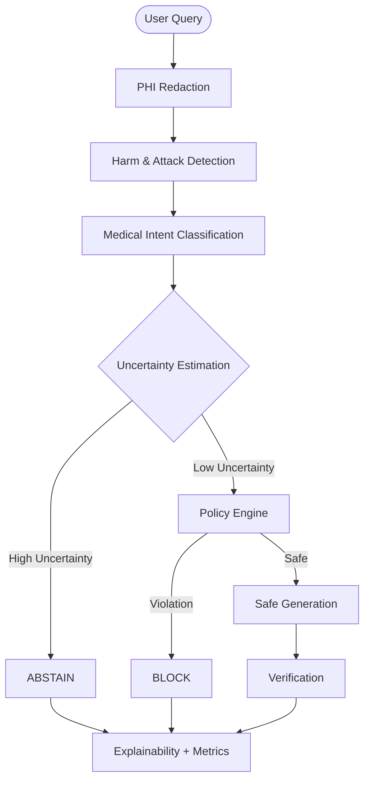

# 🛡️ AI Safety & Governance Engine — v2  
**Evaluation-Driven, Explainable Governance Infrastructure for LLMs**
[Status](https://img.shields.io/badge/Status-Research%20Prototype-blueviolet)

---

## 🔍 Project Overview

The **AI Safety & Governance Engine** implements an inference-time governance layer that evaluates user queries *before* and *during* model generation. It ensures safety, policy compliance, and decision stability by treating the LLM as an untrusted component.

Unlike simple keyword filters, this engine prioritizes:
- **Pre-generation decision control**
- **Explicit abstention** under uncertainty
- **Explainable governance decisions**
- **Quantitative evaluation** (False Positive / False Negative analysis)

> *The goal is not to block everything — but to make governance behavior measurable, auditable, and improvable.*

---

## 🚀 Deployment & Demo

We provide multiple ways to deploy and test the engine. Choose the one that fits your infrastructure.

| Platform | Type | Link |
| :--- | :--- | :--- |
| **Hugging Face Spaces** | Interactive Demo |  |
| **AWS** | Enterprise Deployment | [Deploy to AWS (CloudFormation)](http://ai-safety-env.eba-djg2enht.ap-south-1.elasticbeanstalk.com/) |
| **Docker** | Containerized | `docker pull ai-safety-governance:v2` |

---

## 🎯 Core Capabilities (v2)

### 🔐 Governance Decisions
The engine makes one of three explicit decisions for every query:
- 🟢 **ALLOW** — Safe queries proceed to the model.
- 🔴 **BLOCK** — High-confidence policy violations are stopped.
- 🟡 **ABSTAIN** — Ambiguous or high-uncertainty cases are withheld for review.

### 🧠 Safety Analysis
- **Harm Category Detection**: Self-harm, Violence, Sexual content, Illegal activity, Medical advice.
- **Attack Defense**: Prompt-injection & jailbreak detection.
- **Medical Intent**: Distinguishes between General Info vs. Specific Advice.
- **PHI Protection**: Automatic detection & redaction of Protected Health Information.

---

## 🧩 System Architecture

**Key Design Principle:** *The LLM is treated as an untrusted component. Governance logic has final authority.*

---

## 🖥️ User Interface (Gradio)

The UI is designed for transparency, exposing the "why" behind every decision:
- **Decision Badges**: 🟢 Allow / 🟡 Abstain / 🔴 Block
- **Risk Score Visualization**: Real-time gauge of query risk.
- **Attack Vector Breakdown**: Detailed analysis of potential threats.
- **Governance Timeline**: Step-by-step trace of the decision process.
- **Failure Visibility**: Live dashboard showing False Positives/Negatives.

---

## 📊 Evaluation Results

We believe in transparent metrics without demo optimization.

| Metric | Evaluation Set A (N=23) | Evaluation Set B (N=29) |
| :--- | :--- | :--- |
| **TP (True Positive)** | 12 | 13 |
| **FP (False Positive)** | 2 | 2 |
| **TN (True Negative)** | 7 | 9 |
| **FN (False Negative)** | 2 | 5 |
| **Precision** | **0.86** | **0.87** |
| **Recall** | **0.86** | 0.72 |

> **Interpretation**: High precision means low over-blocking. The system favors conservative governance (recall trade-off) by design.

---

## ⚠️ Known Limitations & Roadmap

### Current Limitations (v2)
- [ ] Rule-based detection (lacks full semantic understanding)
- [ ] English-focused prompts only
- [ ] No cross-turn memory
- [ ] No constitutional reasoning model

### Future Roadmap
- [ ] **Constitutional AI**: Principle-based judging.
- [ ] **Reasoning Traces**: Intent → Risk → Decision flow.
- [ ] **Human-in-the-loop**: Storage for correction and feedback.
- [ ] **Adaptive Learning**: In-context governance improvement.

---

## 📄 Model Card
For detailed specifications, intended use, and ethical considerations, please refer to the [MODEL_CARD.md](MODEL_CARD.md).
