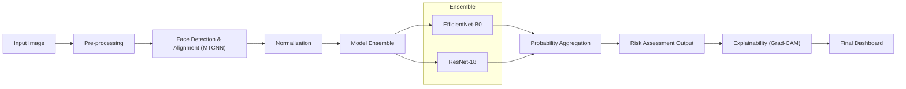

# 🧬 Down Syndrome Facial Risk Screening
### A Research Prototype for Visual Risk Assessment vs Explainability & Governance-Aware Design

[](https://huggingface.co/)
[](LICENSE)
[](https://www.python.org/)

[**View Live Demo**](# 🧬 Down Syndrome Facial Risk Screening
### A Research Prototype for Visual Risk Assessment vs Explainability & Governance-Aware Design

[](https://huggingface.co/)
[](LICENSE)
[](https://www.python.org/)

[**View Live Demo**](https://huggingface.co/spaces/jash-ai/ds-jaswanth-gradcam) &nbsp; | &nbsp; [**Read the Model Card**](MODEL_CARD.md)

---

> [!CAUTION]
> **DISCLAIMER: NOT A DIAGNOSTIC TOOL**
> This system is a **research artifact** designed to study AI behavior in high-stakes contexts. It is **not** a medical device. It cannot diagnose Down Syndrome. It should **never** be used for clinical decision-making.

---

## 1. Executive Summary

This project presents a research-oriented AI system for visual risk screening of facial patterns associated with Down Syndrome. It utilizes a **CNN Ensemble (EfficientNet + ResNet)** coupled with extensive explainability mechanisms (Grad-CAM).

**Core Contribution:**
Rather than pursuing pure accuracy, this project focuses on **Responsible AI Engineering**:
*   **Studying Behavior**: How deep vision models behave in medical-adjacent contexts.
*   **Explainability**: Integrating visual attention maps without overclaiming causality.
*   **Ethical Design**: Prioritizing uncertainty quantification and transparent limitations over hype.

## 2. Problem Context & Motivation

Down Syndrome (Trisomy 21) is a genetic condition confirmed via chromosomal analysis. While certain facial dysmorphologies are associated with the condition, relying on visual appearance for diagnosis is fraught with ethical and technical risks.

We explore this domain to address critical challenges in medical AI:
*   **Variability**: Facial features vary widely across age, ethnicity, and lighting.
*   **Overfitting**: Models can easily latch onto spurious correlations (e.g., background, image quality).
*   **Illusion of Understanding**: Heatmaps can look convincing even when the model is wrong.

This project serves as a **constraint-based experiment** in designing AI systems that refuse to be overconfident.

## 3. System Architecture

The pipeline is designed for robustness and transparency, not just classification.



## 4. Key Technical Features

*   ** robust Preprocessing**: End-to-end alignment pipeline using MTCNN to standardize facial pose.
*   **Ensemble Inference**: A voting mechanism between EfficientNet and ResNet to reduce model-specific bias.
*   **Governance-First UI**: A Gradio web interface that strictly frames outputs as "Risk Indicators" rather than diagnostic predictions.
*   **Interpretability**: Integrated Grad-CAM visualization to expose model attention centers (e.g., creating accountability if the model looks at hair or background).

## 5. Evaluation & Results

Evaluation is performed on a strict held-out test set to gauge dataset discrimination capability.

| Metric | Value |
| :--- | :--- |
| **AUC** | **0.9667** |
| **Accuracy** | 89.89% |
| **F1-Score** | 0.9053 |

### Confusion Matrix
```
[[37,  8],
 [ 1, 43]]
```
*Visual artifacts (ROC curves, Confusion Matrices) are available in the `/assets` directory.*

> [!NOTE]
> These metrics reflect performance on a specific dataset. They do **not** imply clinical validity in a real-world setting.

## 6. Explainability: Use & Misuse

We employ **Grad-CAM** (Gradient-weighted Class Activation Mapping) to visualize "where" the model looks.

*   ✅ **Proper Use**: Debugging model focus (e.g., ensuring it looks at facial landmarks).
*   ❌ **Misuse**: Interpreting heatmaps as "identifying the disease."

**We explicitly warn users:** Heatmaps are mathematical attention indicators, not biological reasoning.

## 7. Project Structure

```bash
📦 down_syndrome_screening
├── 📂 models/              # Pre-trained CNN weights (SafeTensors/PT)
├── 📂 clean_aligned/       # (GitIgnore) Preprocessed training data
├── 📂 prep_logs/           # Automation logs for transparency
├── 📂 assets/              # Evaluation artifacts (Plots, Charts)
├── 📜 app.py               # FastAPI Backend for high-performance inference
├── 📜 app_gradio.py        # Interactive Research UI
├── 📜 MODEL_CARD.md        # Ethical & Technical documentation
├── 📜 PIPELINE_DIAGRAM.txt # ASCII/Detailed pipeline specs
└── 📜 README.md            # You are here
```

## 8. Ethical Guardrails & Limitations

We have implemented hard constraints to prevent misuse:

1.  **Research License**: Strictly non-clinical usage.
2.  **Dataset Limitations**: We acknowledge limited demographic diversity in the training set.
3.  **Algorithmic Bias**: Potential for performance disparity across different ages/ethnicities due to face detection limitations.
4.  **No Automated Decisions**: The system refuses to make a binary "Yes/No" decision without accompanying uncertainty metrics.

## 9. Getting Started

### Prerequisites
*   Python 3.8+
*   `pip install -r requirements.txt`

### Running the Demo
```bash
python app_gradio.py
```
Visit `http://localhost:7860` to access the research interface.

---

### Author
**A JASWANTH*
*Researching the intersection of Medical AI, Ethics, and Explainability.*
) &nbsp; | &nbsp; [**Read the Model Card**](MODEL_CARD.md)

---


> 
